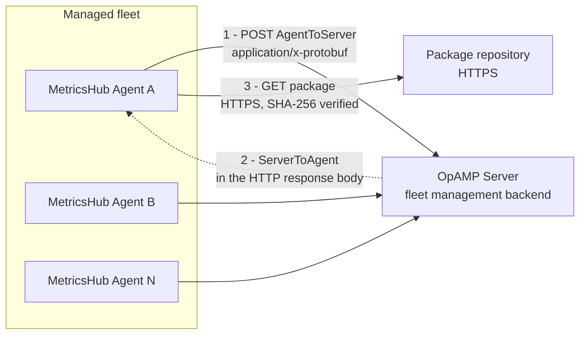
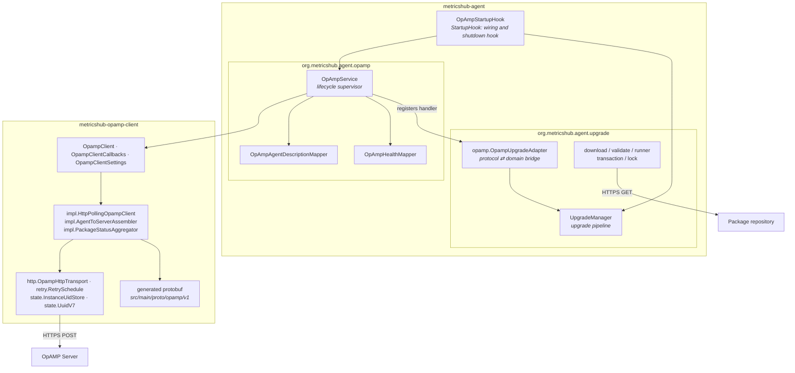
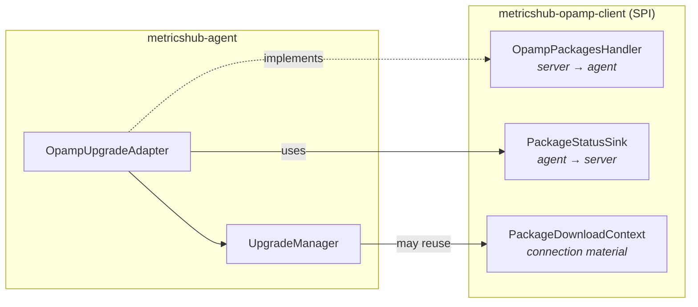
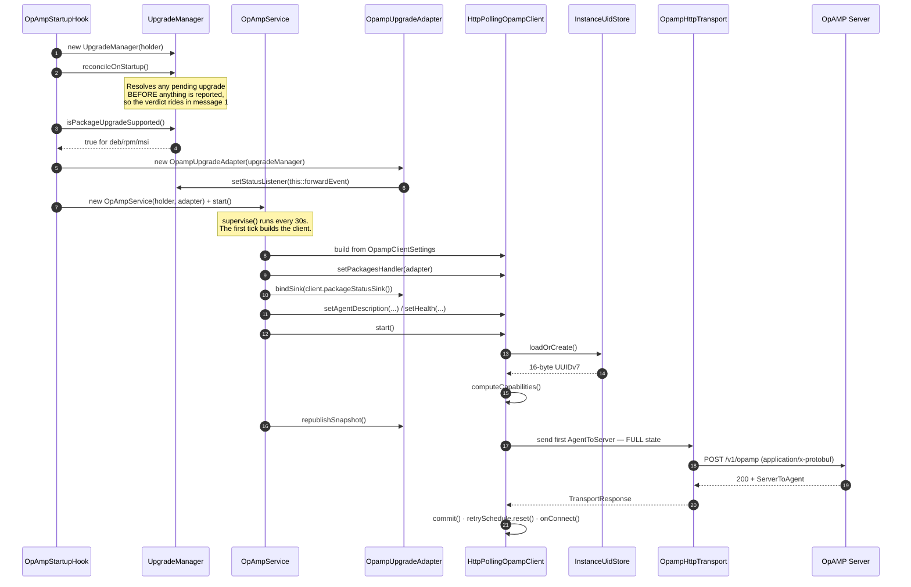
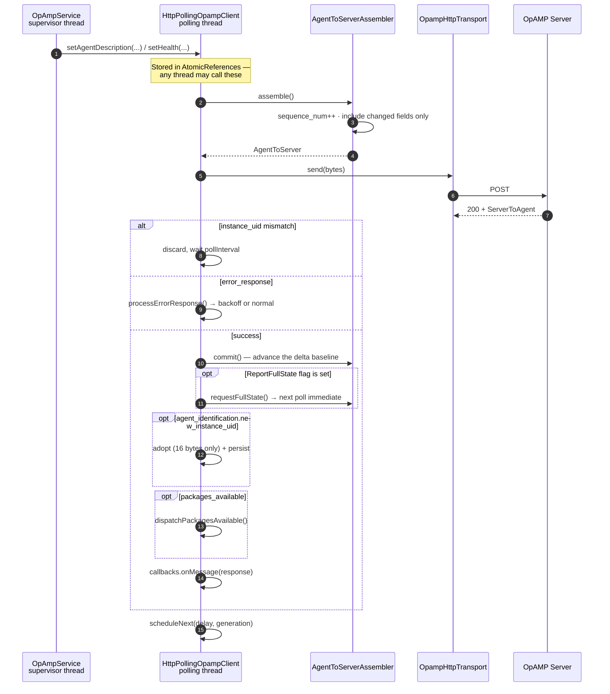
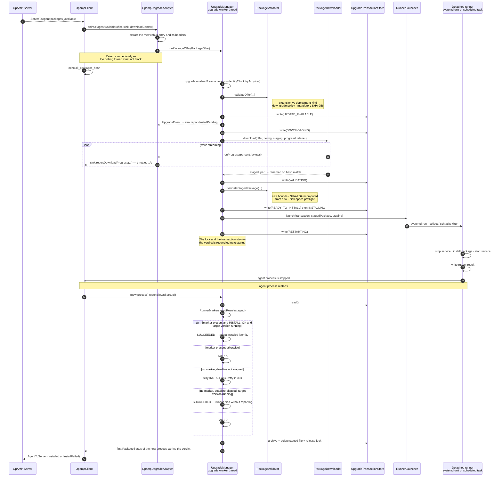
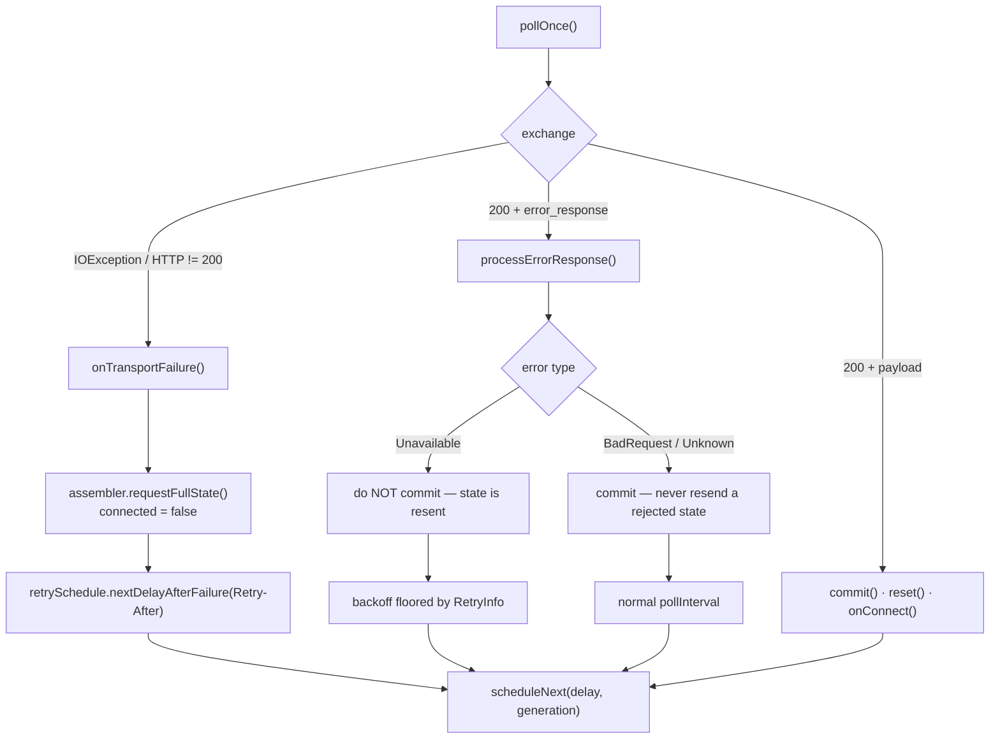
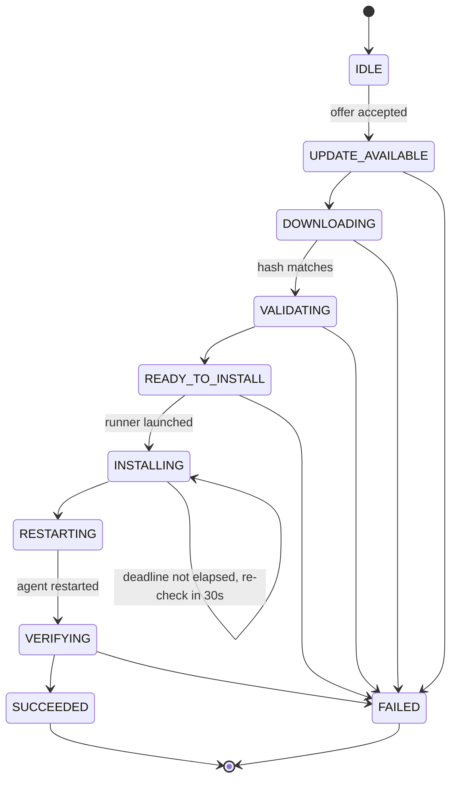

># Fleet Management — OpAMP Architecture

**Audience:** maintainers of the MetricsHub Community Edition.
**Scope:** the embedded OpAMP client (`metricshub-opamp-client`) and the fleet-driven features it powers in `metricshub-agent` — status/health reporting and automatic package upgrades.

This document starts generic and drills down progressively:

| Section | Level |
|---|---|
| [1. What fleet management means here](#1-what-fleet-management-means-here) | Bird's eye |
| [2. Module map](#2-module-map) | Modules |
| [3. Protocol — messages currently supported](#3-protocol--messages-currently-supported) | Wire |
| [4. Component responsibilities](#4-component-responsibilities) | Classes |
| [5. Workflows](#5-workflows) | Sequences |
| [6. Upgrade state machine](#6-upgrade-state-machine) | States |
| [7. Threading model](#7-threading-model) | Runtime |
| [8. On-disk state](#8-on-disk-state) | Persistence |
| [9. Configuration reference](#9-configuration-reference) | Operator |
| [10. Security decisions](#10-security-decisions) | Hardening |
| [11. Extending the client](#11-extending-the-client) | Contributor |
| [12. Test map](#12-test-map) | Verification |

---

## 1. What fleet management means here

MetricsHub agents are managed remotely through **OpAMP** (Open Agent Management Protocol). Two capabilities are implemented today:

1. **Observation** — every agent reports *who it is* (`AgentDescription`), *how it is doing* (`ComponentHealth`) and *what it has installed* (`PackageStatuses`).
2. **Automatic upgrade** — the server offers a package (`PackagesAvailable`); the agent downloads, validates, installs it through a detached runner, restarts, and reports the verdict.

Remote configuration is **not** implemented (see [§3.4](#34-not-implemented)).

### 1.1 Connection model



Three properties drive the whole design:

* **The agent always dials out.** The server never opens a connection to an agent. Only outbound HTTPS egress is required — no inbound firewall rule, no listener on the agent side.
* **Plain HTTP transport, not WebSocket.** One `POST` carries the agent's status *up* and the server's instructions *down*, in the same request/response pair. The server cannot push or wake an agent: an offer waits server-side until the agent's next poll.
* **The agent decides.** Every server instruction is an *offer*. The agent validates it against its own local policy (`upgrade:` section) and may refuse it. A compromised server cannot make the agent fetch credentials-bearing downloads from an arbitrary host ([§10](#10-security-decisions)).

### 1.2 Poll cadence

| Situation | Next poll |
|---|---|
| Nominal | `opamp.pollInterval` (default 30 s) |
| Server set the `ReportFullState` flag | Immediately, with the full state |
| Terminal package status reached (`Installed` / `InstallFailed`) | Immediately, via `OpampClient.pollNow()` |
| Transport failure or HTTP != 200 | Exponential backoff with jitter, capped at 10 min, floored by `Retry-After` |
| Server answered `ServerErrorResponse(Unavailable)` | Same backoff, floored by `RetryInfo.retry_after_nanoseconds` |
| Server answered `ServerErrorResponse(BadRequest / Unknown)` | Normal interval — the message is *not* retried |

---

## 2. Module map



### 2.1 Why two modules

| Module | Knows about | Deliberately does **not** know about |
|---|---|---|
| `metricshub-opamp-client` | The OpAMP wire protocol, protobuf, polling, retry, instance identity | MetricsHub, its configuration model, upgrades, installers |
| `metricshub-agent` | MetricsHub semantics: version, health, deployment kind, installers | Protobuf wire details, outside the two mapper classes and the adapter |

The seam is three interfaces owned by the client module and implemented by the agent module:



`metricshub-opamp-client` depends only on `protobuf-java`, `slf4j-api` and Lombok. The protobuf sources are the **vendored upstream opamp-spec protos** under [`src/main/proto/opamp/v1/`](metricshub-opamp-client/src/main/proto/opamp/v1/opamp.proto), compiled by `protobuf-maven-plugin`. The full spec is generated; only a subset is used ([§3](#3-protocol--messages-currently-supported)).

---

## 3. Protocol — messages currently supported

### 3.1 `AgentToServer` — what the agent sends

Assembled by [`AgentToServerAssembler.assemble()`](metricshub-opamp-client/src/main/java/org/metricshub/opamp/client/impl/AgentToServerAssembler.java).

| # | Field | Sent | Populated by | When |
|---|---|---|---|---|
| 1 | `instance_uid` | ✅ always | `InstanceUidStore` (UUIDv7, persisted) | Every message |
| 2 | `sequence_num` | ✅ always | `AgentToServerAssembler` | Incremented on **every** assembled message, retries included |
| 3 | `agent_description` | ✅ | `OpAmpAgentDescriptionMapper` | Full-state report, or when the value changed since the last **acknowledged** report |
| 4 | `capabilities` | ✅ always | `HttpPollingOpampClient.computeCapabilities()` | Every message |
| 5 | `health` | ✅ | `OpAmpHealthMapper` | Same delta rule; suppressed when `opamp.reportHealth: false` |
| 6 | `effective_config` | ❌ | — | Not implemented |
| 7 | `remote_config_status` | ❌ | — | Not implemented |
| 8 | `package_statuses` | ✅ | `PackageStatusAggregator.toProto()` | Same delta rule; only when a packages handler is registered |
| 9 | `agent_disconnect` | ✅ | `AgentToServerAssembler.assembleDisconnect()` | Best-effort final message on `stop()` |
| 10 | `flags` | ❌ | — | Never set |
| 11 | `connection_settings_request` | ❌ | — | Not implemented |
| 12 | `custom_capabilities` | ❌ | — | Not implemented |
| 13 | `custom_message` | ❌ | — | Not implemented |
| 14 | `available_components` | ❌ | — | Not implemented |
| 15 | `connection_settings_status` | ❌ | — | Not implemented |

**Delta compression rule.** Fields 3, 5 and 8 are omitted when unchanged. The comparison baseline advances only in `commit()`, which runs **after** a successful exchange — so a value lost to a network failure is resent, never silently dropped. A `ReportFullState` flag or any transport failure calls `requestFullState()`, forcing the next message to carry everything.

#### Capabilities bitmask

| Capability | Advertised when |
|---|---|
| `ReportsStatus` (`0x1`) | Always — mandatory |
| `ReportsHealth` (`0x800`) | `opamp.reportHealth: true` (default) |
| `AcceptsPackages` (`0x8`) | A packages handler is registered: `upgrade.enabled` **and** the deployment is `deb`/`rpm`/`msi` |
| `ReportsPackageStatuses` (`0x10`) | Same condition as `AcceptsPackages` |

All other capability bits are 0, which is how the server learns not to send remote config, connection-settings offers or restart commands.

#### `AgentDescription` attributes

The reported attributes are merged in three layers, each overriding the previous:

1. the pre-built `AgentInfo` attributes;
2. the agent-level `attributes:` section of `metricshub.yaml` — the same precedence the agent applies to its self-observability resource;
3. the `opamp: attributes:` section, which **always wins**: it tailors the identity exposed to the fleet manager without touching the attributes attached to the exported metrics.

| Attribute | Identifying | Source |
|---|---|---|
| `service.name` | ✅ | Agent attributes |
| `service.version` | ✅ | Agent `service.version` attribute, falling back to `version` |
| `host.name` | ✅ | Agent host name attribute |
| `host.arch` | ❌ | `System.getProperty("os.arch")` |
| `installer.type` | ❌ | `DeploymentDetector.detect()` → `deb`, `rpm`, `msi`, `archive`, `docker` |
| *every other agent attribute* | ❌ | `AgentInfo` (`os.type`, `host.type`, `agent.host.name`, `name`, `build_number`, `build_date`, `cc_version`), the agent-level `attributes:` and the `opamp: attributes:` (e.g. `site`, `env`, `fleet`) |

`installer.type` is what lets an OpAMP server pick the right artifact. Without it the server cannot tell a Debian host from an RPM host and must not offer anything. Blank values are skipped; a failed detection simply omits the attribute. A configured attribute overrides the derived one, so `host.arch` and `installer.type` can be forced from `metricshub.yaml`. Attributes are reported in a stable, sorted order so an unchanged configuration never looks like a change to the client.

#### `ComponentHealth`

| Field | Value |
|---|---|
| `healthy` | `ApplicationStatus.status == UP` |
| `status` | The application status string |
| `start_time_unix_nano` | JVM start time (`RuntimeMXBean`) |
| `status_time_unix_nano` | Now |
| `component_health_map["otel_collector"]` | Collector sub-status; healthy when `running` or `disabled` |

Resource counters, memory and CPU are **deliberately excluded** — they already flow through the OTLP self-monitoring pipeline.

#### `PackageStatuses`

One entry, keyed `metricshub` (`UpgradeManager.PACKAGE_NAME`), built by [`OpampUpgradeAdapter.toPackageStatus()`](metricshub-agent/src/main/java/org/metricshub/agent/upgrade/opamp/OpampUpgradeAdapter.java).

| `PackageStatus` field | Sent | Source |
|---|---|---|
| `name` | ✅ | Constant `metricshub` |
| `agent_has_version` | ✅ | Running agent version |
| `agent_has_hash` | ✅ when known | Identity hash learned from a previous OpAMP-driven install (`installed-package.json`) |
| `server_offered_version` | ✅ during an attempt | `PackageAvailable.version` |
| `server_offered_hash` | ✅ during an attempt | `PackageAvailable.hash` |
| `status` | ✅ | Mapped from `UpgradeState` ([§6](#6-upgrade-state-machine)) |
| `error_message` | ✅ on failure | Upgrade failure cause |
| `download_details` | ✅ while downloading | `download_percent`, `download_bytes_per_second`, throttled to 1/s |
| `PackageStatuses.server_provided_all_packages_hash` | ✅ | Echo of the last **accepted** offer's `all_packages_hash` |
| `PackageStatuses.error_message` | ❌ | Not set — per-package errors are used instead |

The `all_packages_hash` echo is only updated once the handler accepted the offer. On failure the previous hash keeps being echoed, so the server sees the offer is unsynchronized and offers it again.

### 3.2 `ServerToAgent` — what the agent understands

Processed by [`HttpPollingOpampClient.processServerToAgent()`](metricshub-opamp-client/src/main/java/org/metricshub/opamp/client/impl/HttpPollingOpampClient.java).

| # | Field | Handled | Effect |
|---|---|---|---|
| 1 | `instance_uid` | ✅ | Must match the request UID; a non-empty mismatch discards the whole message (multiplexing guard). Empty is tolerated |
| 2 | `error_response` | ✅ | `Unavailable` → backoff, state **not** committed, resent. `BadRequest`/`Unknown` → committed and not retried, per spec |
| 3 | `remote_config` | ⚠️ forwarded only | Delivered raw to `OpampClientCallbacks.onMessage`; no built-in handling |
| 4 | `connection_settings` | ⚠️ forwarded only | Same |
| 5 | `packages_available` | ✅ | Dispatched to the registered `OpampPackagesHandler` |
| 6 | `flags` | ✅ partially | Only `ServerToAgentFlags_ReportFullState` is acted on: full state, re-poll immediately. `ReportAvailableComponents` is ignored |
| 7 | `capabilities` | ⚠️ forwarded only | The agent does not adapt its behavior to server capabilities |
| 8 | `agent_identification` | ✅ | `new_instance_uid` adopted in memory **and** persisted. Rejected unless exactly 16 bytes — a malformed UID cannot poison the identity |
| 9 | `command` | ⚠️ forwarded only | `RESTART` is **not** implemented (`AcceptsRestartCommand` is not advertised) |
| 10 | `custom_capabilities` | ⚠️ forwarded only | — |
| 11 | `custom_message` | ⚠️ forwarded only | — |

> "Forwarded only" means the parsed message reaches `OpampClientCallbacks.onMessage(ServerToAgent)`, which the agent currently implements as a no-op (`OpAmpService.LoggingCallbacks` only overrides connectivity callbacks). That callback is the designated extension point.

#### `PackagesAvailable` fields consumed

| Field | Used | Note |
|---|---|---|
| `packages["metricshub"]` | ✅ | Any other key is ignored; an offer without this key is logged and dropped |
| `all_packages_hash` | ✅ | Echoed back after acceptance |
| `PackageAvailable.version` | ✅ | Target version, compared with the running one |
| `PackageAvailable.hash` | ✅ | Package **identity**; drives "already installed?" and is echoed as `server_offered_hash` |
| `PackageAvailable.type` | ❌ | Not inspected — `TopLevel` is assumed |
| `DownloadableFile.download_url` | ✅ | Validated against `upgrade.hostAllowlist` and the deployment's expected extension |
| `DownloadableFile.content_hash` | ✅ | Mandatory SHA-256, verified while streaming **and** recomputed from disk |
| `DownloadableFile.headers` | ✅ | Merged under locally configured `upgrade.downloadHeaders` — local wins ([§10](#10-security-decisions)) |
| `DownloadableFile.signature` | ❌ | Detached signatures unsupported. On Windows, MSI Authenticode is verified instead (`upgrade.msiSignatureSubjectContains`) |

### 3.3 Transport

| Aspect | Value |
|---|---|
| Method / content type | `POST`, `Content-Type: application/x-protobuf` |
| Client | JDK `HttpClient` ([`OpampHttpTransport`](metricshub-opamp-client/src/main/java/org/metricshub/opamp/client/http/OpampHttpTransport.java)) |
| Success | HTTP 200 only; anything else is a transport failure |
| `Retry-After` | Parsed (delta-seconds or HTTP-date) and used as a backoff floor |
| TLS | System trust store, or a PEM pinned via `opamp.certificateFile` |
| Auth | Arbitrary configured headers (typically `Authorization`), values decryptable from the MetricsHub keystore |

### 3.4 Not implemented

| OpAMP feature | Status | What it would take |
|---|---|---|
| Remote configuration (`AcceptsRemoteConfig`, `ReportsEffectiveConfig`, `ReportsRemoteConfig`) | Not implemented | Handle `remote_config`, write `metricshub.yaml`, report `RemoteConfigStatus` + `EffectiveConfig` |
| Connection settings offers | Not implemented | Handle `connection_settings`, rewrite the `opamp:`/OTLP config, report `ConnectionSettingsStatus` |
| Restart command | Not implemented | Advertise `AcceptsRestartCommand`, handle `command` |
| Own telemetry redirection (`ReportsOwnMetrics/Traces/Logs`) | Not implemented | Reconfigure the OTLP exporters from the offer |
| Custom capabilities / messages | Not implemented | Advertise `CustomCapabilities`, exchange `CustomMessage` |
| Available components | Not implemented | Advertise and populate `available_components` |
| WebSocket transport | Not implemented | New `OpampTransport` implementation + server-push loop |
| Heartbeat capability | Not implemented | Honor `OpAMPConnectionSettings.heartbeat_interval_seconds` |

---

## 4. Component responsibilities

### 4.1 `metricshub-opamp-client`

| Class | Responsibility |
|---|---|
| [`OpampClient`](metricshub-opamp-client/src/main/java/org/metricshub/opamp/client/OpampClient.java) | Public contract: `start` / `stop` / `setAgentDescription` / `setHealth` / `setPackagesHandler` / `packageStatusSink` / `pollNow` |
| [`OpampClientSettings`](metricshub-opamp-client/src/main/java/org/metricshub/opamp/client/OpampClientSettings.java) | Immutable settings — endpoint, headers (defensively copied), CA file, poll interval, timeout, max backoff, instance-UID file, health toggle |
| [`OpampClientCallbacks`](metricshub-opamp-client/src/main/java/org/metricshub/opamp/client/OpampClientCallbacks.java) | `onConnect` / `onConnectFailed` / `onErrorResponse` / `onMessage` — all defaulted, all invoked on the polling thread |
| [`HttpPollingOpampClient`](metricshub-opamp-client/src/main/java/org/metricshub/opamp/client/impl/HttpPollingOpampClient.java) | **The engine.** Owns the polling chain and generation counter, capability computation, response dispatch, instance-UID adoption, disconnect, callback containment |
| [`AgentToServerAssembler`](metricshub-opamp-client/src/main/java/org/metricshub/opamp/client/impl/AgentToServerAssembler.java) | Message construction and the delta/full-state compression rules (`assemble` / `commit` / `requestFullState`) |
| [`PackageStatusAggregator`](metricshub-opamp-client/src/main/java/org/metricshub/opamp/client/impl/PackageStatusAggregator.java) | Thread-safe `PackageStatusSink`: status map, 1/s progress throttling, terminal-status fast poll, `all_packages_hash` echo |
| [`OpampHttpTransport`](metricshub-opamp-client/src/main/java/org/metricshub/opamp/client/http/OpampHttpTransport.java) | One HTTP exchange; PEM trust material; header sanitation; `Retry-After` parsing |
| [`RetrySchedule`](metricshub-opamp-client/src/main/java/org/metricshub/opamp/client/retry/RetrySchedule.java) | Exponential backoff with `[delay/2, delay]` jitter, capped, floored by server hints |
| [`InstanceUidStore`](metricshub-opamp-client/src/main/java/org/metricshub/opamp/client/state/InstanceUidStore.java) / [`UuidV7`](metricshub-opamp-client/src/main/java/org/metricshub/opamp/client/state/UuidV7.java) | Stable agent identity across restarts **and upgrades**; atomic write (temp file + move) |

### 4.2 `metricshub-agent` — OpAMP side

| Class | Responsibility |
|---|---|
| [`OpAmpStartupHook`](metricshub-agent/src/main/java/org/metricshub/web/service/OpAmpStartupHook.java) | **The wiring**, as a `StartupHook`: reconcile pending upgrade → decide whether the deployment is upgradable → build handler → start `OpAmpService` → register shutdown hook. Runs on `ApplicationReadyEvent`, so the enterprise agent — which boots the same Spring context — needs no wiring of its own |
| [`MetricsHubAgentApplication`](metricshub-agent/src/main/java/org/metricshub/agent/MetricsHubAgentApplication.java) | Boots the agent context and the Spring server; no longer wires OpAMP itself |
| [`OpAmpService`](metricshub-agent/src/main/java/org/metricshub/agent/opamp/OpAmpService.java) | **Lifecycle supervisor.** Lives *outside* the restartable `AgentContext`. Every 30 s: re-reads `opamp:`, rebuilds the client only on change, otherwise refreshes description and health |
| [`OpAmpAgentDescriptionMapper`](metricshub-agent/src/main/java/org/metricshub/agent/opamp/OpAmpAgentDescriptionMapper.java) | `AgentInfo` + `attributes:` + `opamp: attributes:` + `DeploymentKind` → `AgentDescription` |
| [`OpAmpHealthMapper`](metricshub-agent/src/main/java/org/metricshub/agent/opamp/OpAmpHealthMapper.java) | `ApplicationStatus` → `ComponentHealth` |
| [`OpAmpConfig`](metricshub-agent/src/main/java/org/metricshub/agent/config/OpAmpConfig.java) | The `opamp:` YAML section |

**Why a supervisor rather than a context-scoped bean:** the MetricsHub configuration is hot-reloadable and rebuilds the whole `AgentContext`. Tying the OpAMP client to that lifecycle would drop the connection on every unrelated edit. The supervisor compares the `opamp:` (and `upgrade.enabled`) values and rebuilds *only* when they actually change. A failed startup clears `activeConfig`, so the next tick retries — a transient error (missing CA file) doesn't disable OpAMP until restart.

### 4.3 `metricshub-agent` — upgrade side

| Class | Responsibility |
|---|---|
| [`OpampUpgradeAdapter`](metricshub-agent/src/main/java/org/metricshub/agent/upgrade/opamp/OpampUpgradeAdapter.java) | The bridge, both ways: `PackagesAvailable` → `PackageOffer`, and `UpgradeEvent` → `PackageStatus`. Also rebinds the sink when the client is rebuilt (`bindSink`, `republishSnapshot`) |
| [`UpgradeManager`](metricshub-agent/src/main/java/org/metricshub/agent/upgrade/UpgradeManager.java) | **The pipeline.** Offer admission, transaction persistence, download, validation, detached launch, and startup reconciliation |
| [`PackageOffer`](metricshub-agent/src/main/java/org/metricshub/agent/upgrade/api/PackageOffer.java) / [`UpgradeEvent`](metricshub-agent/src/main/java/org/metricshub/agent/upgrade/api/UpgradeEvent.java) | Protobuf-free domain records crossing the bridge |
| [`PackageDownloader`](metricshub-agent/src/main/java/org/metricshub/agent/upgrade/download/PackageDownloader.java) | Streaming HTTPS download to `.part`, SHA-256 while streaming, size cap, redirect policy, per-origin header binding, deadline watchdog |
| [`PackageValidator`](metricshub-agent/src/main/java/org/metricshub/agent/upgrade/validate/PackageValidator.java) | Offer admission (extension vs deployment kind, downgrade policy, mandatory SHA-256) and staged-file checks (size, re-hash from disk, disk-space preflight) |
| [`DeploymentDetector`](metricshub-agent/src/main/java/org/metricshub/agent/upgrade/runner/DeploymentDetector.java) / [`DeploymentKind`](metricshub-agent/src/main/java/org/metricshub/agent/upgrade/runner/DeploymentKind.java) | Is this host `DEB`, `RPM`, `MSI`, `ARCHIVE` or `DOCKER`? Only the first three are upgradable. Cached — but an indeterminate probe throws instead of caching a wrong verdict |
| [`RunnerLauncherFactory`](metricshub-agent/src/main/java/org/metricshub/agent/upgrade/runner/RunnerLauncherFactory.java) + `LinuxSystemdRunnerLauncher` / `WindowsScheduledTaskRunnerLauncher` / `UnsupportedRunnerLauncher` | Launch the **detached** installer that outlives the agent process |
| [`RunnerMarkers`](metricshub-agent/src/main/java/org/metricshub/agent/upgrade/runner/RunnerMarkers.java) | `runner.result` (`INSTALL_OK` / `INSTALL_FAILED …`) — the runner's verdict, read at the next startup |
| [`UpgradeTransactionStore`](metricshub-agent/src/main/java/org/metricshub/agent/upgrade/transaction/UpgradeTransactionStore.java) / [`UpgradeTransaction`](metricshub-agent/src/main/java/org/metricshub/agent/upgrade/transaction/UpgradeTransaction.java) | The crash-safe journal that survives the restart, plus the installed-package identity record |
| [`UpgradeLock`](metricshub-agent/src/main/java/org/metricshub/agent/upgrade/UpgradeLock.java) | One upgrade at a time |
| [`UpgradeDirectories`](metricshub-agent/src/main/java/org/metricshub/agent/upgrade/UpgradeDirectories.java) | Staging directory that survives the package upgrade itself |
| [`UpgradeConfig`](metricshub-agent/src/main/java/org/metricshub/agent/config/UpgradeConfig.java) | The `upgrade:` YAML section |

---

## 5. Workflows

### 5.1 Startup and first report

The sequence below is driven by [`OpAmpStartupHook`](metricshub-agent/src/main/java/org/metricshub/web/service/OpAmpStartupHook.java), a [`StartupHook`](metricshub-agent/src/main/java/org/metricshub/web/service/StartupHook.java) that [`AgentStartupRunner`](metricshub-agent/src/main/java/org/metricshub/web/service/AgentStartupRunner.java) runs once on `ApplicationReadyEvent`. Both editions boot the same Spring context, so fleet management starts identically in each with no edition-specific bootstrap. One consequence worth knowing: OpAMP now starts only if the Spring context comes up.



Two ordering details worth preserving:

* `reconcileOnStartup()` runs **before** the client starts, so a `SUCCEEDED`/`FAILED` verdict from the previous process is part of the very first report.
* `republishSnapshot()` runs **after** `start()`, because the client seeds its statuses from a pre-start snapshot; a transition racing the handoff would otherwise be overwritten by the older snapshot.

### 5.2 Steady-state poll



**The generation counter.** `pollGeneration` guards the single polling chain. `pollNow()` bumps it, which turns any pending or in-flight poll's rescheduling attempt into a no-op — so an urgent poll never forks the chain into two concurrent loops.

### 5.3 Package offer → upgrade → restart → reconciliation

This is the only flow that spans **two agent processes** and an external installer.



**Why a detached runner.** The installer must stop the very service that launched it. A child process would be killed with its parent's process tree, so:

| Platform | Mechanism | Script |
|---|---|---|
| Linux | `systemd-run --unit=metricshub-upgrade-<id> --collect` — a transient one-shot unit in its own cgroup | [`metricshub-upgrade-runner.sh`](metricshub-assets/src/main/resources/linux/upgrade-runner/metricshub-upgrade-runner.sh) |
| Windows | One-shot Scheduled Task running as SYSTEM, outside the service's process tree (NSSM would otherwise kill it) | [`metricshub-upgrade-runner.ps1`](metricshub-assets/src/main/resources/windows/upgrade-runner/metricshub-upgrade-runner.ps1) + a generated `metricshub-upgrade-launch.cmd` wrapper |
| Archive / Docker | `UnsupportedRunnerLauncher` — defensive only; these deployments never advertise `AcceptsPackages` | — |

**Why the runner marker decides, not the running version.** Package hooks and MSI service controls can start the upgraded agent while the installer is still finalizing — and it may still fail afterwards. A running target version alone is therefore not proof of success. The marker is authoritative; the version check is the fallback once the deadline elapses. This also covers the same-version hotfix case, where comparing versions proves nothing.

### 5.4 Failure and recovery



Backoff: `base << min(failures-1, 16)`, capped at `maxBackoff` (10 min), jittered into `[delay/2, delay]`, then raised to the server-provided floor if any. Reset on the first success.

Callback containment: every consumer callback runs inside `safely(...)`, which swallows anything short of a `VirtualMachineError`. A throwing callback must never break the polling chain — an exception escaping the loop would skip rescheduling and silently stop the client forever.

---

## 6. Upgrade state machine

`UpgradeState` is the agent's fine-grained internal state; OpAMP only has five coarse package statuses. The mapping lives in `OpampUpgradeAdapter.toPackageStatusEnum()`.



| `UpgradeState` | OpAMP `PackageStatusEnum` | Process |
|---|---|---|
| `IDLE`, `SUCCEEDED` | `Installed` | Current |
| `UPDATE_AVAILABLE`, `READY_TO_INSTALL` | `InstallPending` | Current |
| `DOWNLOADING`, `VALIDATING` | `Downloading` | Current |
| `INSTALLING`, `RESTARTING` | `Installing` | Current (then killed) |
| `VERIFYING` | `Installing` | **Next** — reconciliation |
| `FAILED` | `InstallFailed` | Either |

`INSTALLING`, `RESTARTING` and `VERIFYING` are the *install phase* (`UpgradeState.isInstallPhase()`) — the window where the agent process is expected to disappear. That predicate is what tells `reconcileOnStartup()` a transaction needs a verdict rather than an error.

---

## 7. Threading model

| Thread | Owner | Created by | Work |
|---|---|---|---|
| `metricshub-opamp-supervisor` | `OpAmpService` | Single-thread scheduled executor, daemon, fixed delay 30 s | Config reconciliation, description/health refresh |
| `metricshub-opamp-client` | `HttpPollingOpampClient` | Single-thread scheduled executor, daemon | **All** protocol state: assemble, send, parse, dispatch, callbacks |
| `metricshub-upgrade` | `UpgradeManager` | Single-thread executor, daemon | Offer pipeline: download, validate, launch; deferred reconciliation retries |
| `metricshub-upgrade-download-watchdog` | `PackageDownloader` | Static single-thread scheduler | Closes body streams past the download deadline |

Concurrency contracts:

* Protocol state is **confined** to the polling thread. Only the setters (`setAgentDescription`, `setHealth`) and `pollNow()` are cross-thread, and they hand off through `AtomicReference` / a lifecycle lock.
* `PackageStatusAggregator` is a `ConcurrentHashMap` and is written from the upgrade thread while read from the polling thread. `reportDownloadProgress` uses `computeIfPresent` so a progress update racing a terminal `report()` can never resurrect a `Downloading` status.
* `lifecycleLock` also synchronizes the `start()` handoff: values set before `start()` land in `earlyStateBuffer` and are copied into the live assembler, with no window for an update to fall between the two.
* Callbacks run on the polling thread and **must return quickly** — this is why `onPackagesAvailable` only enqueues work on the upgrade thread.

---

## 8. On-disk state

| File | Location | Written by | Purpose |
|---|---|---|---|
| `opamp-instance-uid` | Security directory, next to the MetricsHub keystore | `InstanceUidStore` | Stable `instance_uid` across restarts **and upgrades**. Canonical UUID string, atomic write |
| `upgrade-transaction.json` | Staging directory | `UpgradeTransactionStore` | The crash-safe journal: id, from/to version, URL, hashes, deployment kind, state, `installStartedAt`, `installTimeoutSeconds` |
| `upgrade-transaction.json.<suffix>` | Staging directory | `UpgradeTransactionStore.archive()` | Archived finished transactions (and `.corrupt` for unparseable ones) |
| `installed-package.json` | Staging directory | `UpgradeTransactionStore` | `{version, packageHash}` of the last OpAMP-installed package — the source of `agent_has_hash` |
| `upgrade.lock` | Staging directory | `UpgradeLock` | One upgrade at a time; released on failure, held across the restart |
| `runner.result` | Staging directory | The **detached runner** | `INSTALL_OK` or `INSTALL_FAILED …`; the authoritative install verdict |
| `<package>.part` → `<package>` | Staging directory | `PackageDownloader` | Streaming download, renamed only once the SHA-256 matches |
| Staged runner script | Staging directory | `RunnerScripts.stageScript` | Copy of the shipped runner script, permissions restricted to the owner |

Staging directory (`UpgradeDirectories.resolveStagingDirectory()`):

* Windows — `%ProgramData%\MetricsHub\upgrade`
* Others — `<install>/lib/upgrade` (files unowned by dpkg/rpm survive the package upgrade)

Both locations are chosen to **survive the upgrade that writes them** — that is the whole premise of reconciliation.

---

## 9. Configuration reference

### 9.1 `opamp:`

```yaml
opamp:
  enabled: true
  endpoint: https://opamp.example.com/v1/opamp
  headers:
    Authorization: Bearer ${env::OPAMP_TOKEN}
  attributes:
    site: data-center-1
  # certificateFile: /opt/metricshub/security/opamp-ca.pem
  # pollInterval: 30s
  # requestTimeout: 10s
  # reportHealth: true
```

| Key | Default | Notes |
|---|---|---|
| `enabled` | `false` | Fleet management is opt-in |
| `endpoint` | — | Blank with `enabled: true` logs a warning and starts nothing |
| `headers` | `{}` | Values may be keystore-encrypted. Entries with a null value are skipped, not fatal |
| `attributes` | `{}` | Reported in the `AgentDescription`. Merged **last**, so they override both the pre-built agent attributes and the agent-level `attributes:` — the fleet identity can be tailored without touching the attributes attached to the exported metrics |
| `certificateFile` | system trust store | PEM |
| `pollInterval` | `30s` | Values below 1 s fall back to the default — a tight loop must never hammer the server |
| `requestTimeout` | `10s` | Same guard |
| `reportHealth` | `true` | Drives the `ReportsHealth` capability |

### 9.2 `upgrade:`

```yaml
upgrade:
  enabled: true
  allowDowngrade: false
  hostAllowlist: [ repo.metricshub.com ]
  # serviceName: metricshub-community-service.service
  # installTimeout: 30m
  # trustedCertificateFile: /opt/metricshub/security/repo-ca.pem
  # downloadHeaders:
  #   nexus.example.com:
  #     Authorization: Basic ${env::REPO_CREDENTIALS}
```

| Key | Default | Notes |
|---|---|---|
| `enabled` | `true` | Honored only when `opamp.enabled` is true |
| `allowDowngrade` | `false` | Offers older than the running version are refused |
| `maxPackageSizeBytes` | 1 GiB | |
| `downloadTimeout` | `1800s` | Per attempt, enforced by the watchdog |
| `downloadRetries` | `3` | |
| `installTimeout` | `1800s` | Reconciliation deadline; persisted in the transaction so both processes agree |
| `hostAllowlist` | `[]` | Empty allows any HTTPS host |
| `downloadHeaders` | `{}` | Keyed by repository **authority** (`host` or `host:port`) — see [§10](#10-security-decisions) |
| `trustedCertificateFile` | system trust store | PEM for the repository |
| `serviceName` | auto-discovered | Per-edition unit/service name; pin it if discovery fails |
| `msiSignatureSubjectContains` | `MetricsHub` | Windows Authenticode subject check |

---

## 10. Security decisions

These are load-bearing; read the rationale before relaxing any of them.

| Decision | Rationale |
|---|---|
| **Configured download credentials are bound to an operator-named authority** (`host` or `host:port`; a bare host means the scheme's default port) | A compromised OpAMP server must not be able to choose where the agent's credentials are sent. An offer pointing at another host — or another *port* of the same host, which is a different service — receives none of them |
| **Configured credentials travel over HTTPS only** | An `http` offer matches no configured header set, whatever its host. The loopback plain-HTTP tolerance exists only for unauthenticated development downloads |
| **Local configuration wins on header name conflicts** (case-insensitive, HTTP semantics) | Operator intent on the machine overrides server metadata; merging into one map also avoids duplicate header lines, since `HttpRequest.Builder.header` appends |
| **SHA-256 is mandatory** and verified twice: while streaming and recomputed from disk | The streaming hash guards the transfer; the on-disk hash guards everything between download and install |
| **`server_offered_hash` is package identity, not just a checksum** | A same-version offer with a different identity is installed (hotfix); an offer whose identity matches the recorded installed one is a no-op |
| **A malformed `new_instance_uid` is rejected** (must be exactly 16 bytes) | A bad server response cannot permanently poison the agent's identity |
| **Response `instance_uid` must match the request** | Guards against cross-agent multiplexing mistakes |
| **Only the runner's marker blesses an install** | Version-only evidence is forgeable by timing: installers can start the new agent before finishing |
| **Package offers are refused outright on non-upgradable deployments** | `archive`/`docker` never advertise `AcceptsPackages`; `UnsupportedRunnerLauncher` is a second line of defence |
| **Runner scripts are staged with owner-only permissions** | The staged script runs as root/SYSTEM |
| **Header values are capped at ISO-8859-1** | The JDK HTTP client's wire encoding; invalid configured headers are skipped rather than failing every poll |

---

## 11. Extending the client

Adding a new OpAMP capability follows a stable recipe:

1. **Advertise it** — add the bit in `HttpPollingOpampClient.computeCapabilities()`, gated on whatever makes it available (a config flag, a registered handler).
2. **Send the new `AgentToServer` field** — add the state holder and the `shouldInclude` / `commit` pair in `AgentToServerAssembler`, so the field participates in delta compression and is correctly resent after a failure.
3. **Handle the new `ServerToAgent` field** — either in `processServerToAgent()` for protocol-level concerns, or by consuming `OpampClientCallbacks.onMessage`, which already receives every parsed message.
4. **Keep MetricsHub semantics out of the client module** — define an SPI interface in `org.metricshub.opamp.client.*` (as `OpampPackagesHandler` does) and implement it in `metricshub-agent`.
5. **Never block the polling thread** — hand long work to a dedicated executor and report back through a sink.

Remote configuration, the most likely next capability, would follow exactly this shape: an `OpampRemoteConfigHandler` SPI, an agent-side implementation writing `metricshub.yaml` and triggering the existing reload path, plus `RemoteConfigStatus` and `EffectiveConfig` on the way back.

---

## 12. Test map

| Concern | Test |
|---|---|
| Delta vs full-state compression, sequence numbers, commit semantics | `AgentToServerAssemblerTest` |
| Polling chain, generations, error responses, identity adoption, disconnect | `HttpPollingOpampClientTest` (with `RecordingTransport`) |
| Status aggregation, progress throttling, terminal fast-poll | `PackageStatusAggregatorTest` |
| Backoff, jitter bounds, server-provided floors | `RetryScheduleTest` |
| Identity persistence and recovery from a corrupt file | `InstanceUidStoreTest`, `UuidV7Test` |
| Settings immutability (defensive header copy) | `OpampClientSettingsTest` |
| **End-to-end over real HTTP** — full state then deltas, package offer round-trip to `Installed`, recovery from a server outage, `AgentDisconnect` on stop | `OpampClientIT` against `FakeOpampServer` (`src/it`) |
| Config reconciliation, client rebuild, settings mapping | `OpAmpServiceTest`, `OpAmpConfigTest` |
| Description and health mapping | `OpAmpMappersTest` |
| Offer translation and status conversion | `OpampUpgradeAdapterTest` |
| Pipeline, failure paths, startup reconciliation | `UpgradeManagerTest`, `UpgradeReconciliationTest` |
| Download source restrictions and header binding | `PackageDownloaderTest` |

Golden protobuf fixtures are produced by `GoldenFixtureWriter`, so wire-format regressions surface as byte-level diffs.

---

## Appendix — glossary

| Term | Meaning |
|---|---|
| **Offer** | Anything the server proposes: a package, a remote config, connection settings. The agent may refuse |
| **Full state report** | An `AgentToServer` carrying every reportable field, sent first, after a failure, or on `ReportFullState` |
| **Identity hash** | `PackageAvailable.hash` — identifies a *package build*, not just its content |
| **Detached runner** | The out-of-process installer that stops, upgrades and restarts the agent service |
| **Reconciliation** | The next process resolving the outcome of an upgrade whose result the previous process could not observe |
| **Deployment kind** | How MetricsHub was installed: `DEB`, `RPM`, `MSI`, `ARCHIVE`, `DOCKER`. Only the first three are upgradable |
