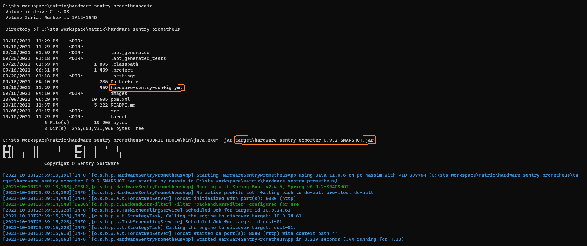

# How to use the Hardware Sentry Prometheus Exporter

  ## Basic execution

   ### Requirements

   - Have the **hws-config.yaml** file
     in the directory from which you run **hardware-sentry-exporter-_\<version\>_.jar** file.<br>

     ###### Example hws-config.yaml file content:
     ```yaml
      ---
      jobPoolSize: 30
      collectPeriod: 2m
      discoveryCycle: 30
      loggerLevel: debug
      outputDirectory: C:\\Users\\nassim\\AppData\\Local\\Temp\\hardware-logs2
      exportTimestamps: false
      targets:
        - target:
            hostname: 10.0.24.61
            type: oob
          snmp:
            version: V2c
            community: public
            port: 161
            timeout: 120
          selectedConnectors: [LenovoIMM]

        - target:
            hostname: ecs1-01
            type: linux
          snmp:
            version: v1
            community: public
            port: 161
            timeout: 120s
          excludedConnectors: [ SunF15K, HPiLO ]
          unknownStatus: 1
     ```

   ### Execution
   The simplest way to execute the Hardware Sentry Prometheus Exporter is:

   ```shell script
   $ java -jar hardware-sentry-exporter-<version>.jar
   ```

   ###### Example:
   

   ###### Note:
   By default, the application can be accessed at http://localhost:8080/metrics.

  ## Using a custom YAML configuration file
  If you wish to specify another file instead of **hws-config.yaml**,
  you can use the _--target.config.file_ option
  with the relative or absolute path to the custom configuration YAML file:

  ```shell script
  $ java -jar hardware-sentry-exporter-<version>.jar --target.config.file=../custom-config.yaml
  ```

  ## Using a different HTTP port
  If you wish to specify another port instead of _8080_,
  you can use the _--server.port_ option with the preferred port:

  ```shell script
  $ java -jar hardware-sentry-exporter-<version>.jar --server.port=8081
  ```

  ## Enabling HTTPS
  Enabling HTTPS can be done by using the _--server.ssl.enabled_ option:

  ```shell script
  $ java -jar hardware-sentry-exporter-<version>.jar --server.ssl.enabled=true
  ```
   ###### Example:
   

   ###### Note:
   Now, the application can be accessed at http://localhost:8080/metrics, or https://localhost:8443/metrics.

  ## Using a different HTTP port when HTTPS is enabled
  When HTTPS is enabled, if you wish to specify another HTTP port instead of _8080_,
  you can use the _--http.port_ option with the preferred port:

  ```shell script
  $ java -jar hardware-sentry-exporter-<version>.jar --server.ssl.enabled=true --http.port=8081
  ```
  ## Using a different HTTPS port when HTTPS is enabled
  When HTTPS is enabled, if you wish to specify another HTTPS port instead of _8443_,
  you can use the _--server.port_ option with the preferred port:

  ```shell script
  $ java -jar hardware-sentry-exporter-<version>.jar --server.ssl.enabled=true --server.port=8444
  ```
   ###### Note:
   The _--http.port_ and _--server.port_ options can be used simultaneously when HTTPS is enabled.

  ## Redirecting the HTTP port to the HTTPS port
  Redirecting the HTTP port to the HTTPS port can be done by using the _--server.ssl.redirect-http_ option:

  ```shell script
  $ java -jar hardware-sentry-exporter-<version>.jar --server.ssl.enabled=true --server.ssl.redirect-http=true
  ```

  ## Enabling the debug mode
  To enable the debug mode, configure the global option `loggerLevel` in the `hws-config.yaml` file. Since the exporter relies on log4j2,
  the accepted levels are: `ALL < TRACE < DEBUG < INFO < WARN < ERROR < FATAL < OFF`

 ```yaml
      ---
      loggerLevel: debug
      targets:
  ```

  By default, the debug output file goes to the `hardware-logs` directory under the temporary directory of the local machine. Example:  `C:\Users\<username>\AppData\Local\Temp\hardware-logs` on Windows or `/tmp/hardware-logs` on Linux.

  If you want to specify another output directory, set the global option `outputDirectory` in the `hws-config.yaml` file

 ```yaml
      ---
      loggerLevel: debug
      outputDirectory: C:\\Users\\nassim\\AppData\\Local\\Temp\\hardware-logs2
      targets:
  ```

  ## Build Docker Image
  ### Prerequisites
  - *Git* to checkout the code.
  - *Java 11* to compile the code.
  - *Maven* to build the project.
  - *Docker Engine* to build and run the container.

  Building the exporter as a docker image can be done via the following steps:

  - Build the Hardware Sentry Exporter for Prometheus
    ```shell script
    $ mvn clean package
    ```
    If you haven't built the **matrix-engine** dependency, run *mvn clean package* from the root directory **matrix**

  - Run the following docker command from the **hardware-sentry-exporter** directory:
    ```shell script
    $ docker build -t hardware-sentry-exporter .
    ```

  ## Running Hardware Sentry Prometheus with Docker
  After building the docker image, bind-mount your *hws-config.yaml* configuration from the host by running:

  ```shell script
  $ docker run -d -p 8080:8080 -v /path/to/hws-config.yaml:/hardware-sentry/hws-config.yaml hardware-sentry-exporter:latest
  ```