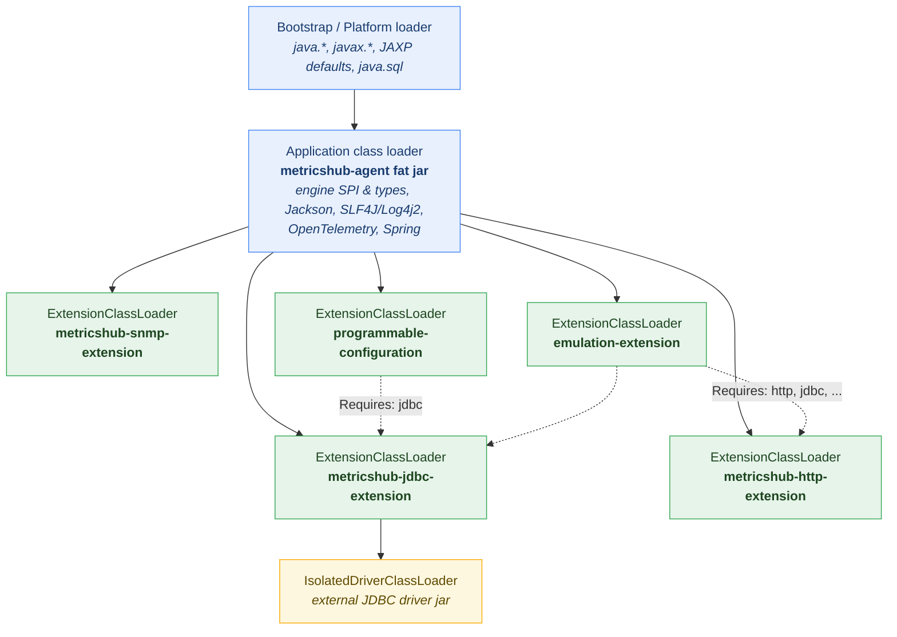
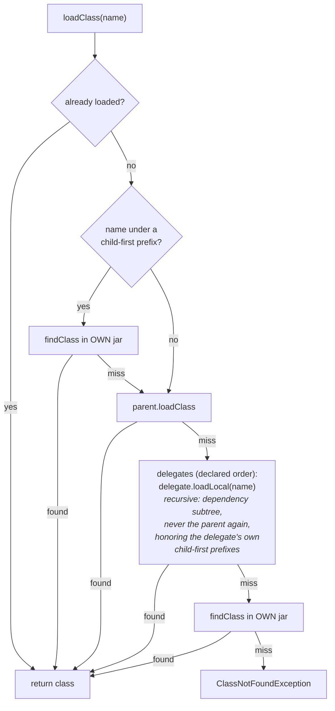
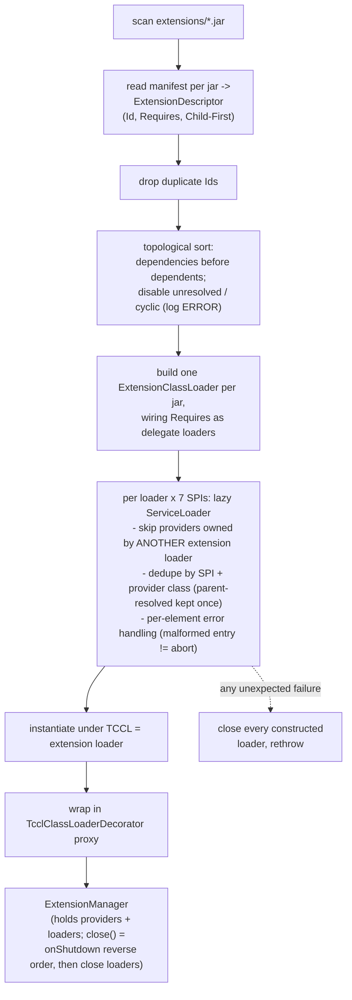

# MetricsHub Extension Class Loading

How the engine (`org.metricshub.engine.extension`) isolates each extension in its own class loader.

## 1. Loader topology

One `ExtensionClassLoader` per jar in `extensions/`. All share the **application class loader** as parent.
`MetricsHub-Extension-Requires` (manifest) wires *delegate* edges between extension loaders.



**Isolation property:** an extension's `META-INF/services` files (JAXP factories, `java.sql.Driver`,
StAX, ...) are visible only to that extension and its declared dependents — never to siblings, never
JVM-wide. This is what fixes the Oracle-`xmlparserv2`-breaks-WinRM class of bug.

ASCII equivalent:

```
                    Bootstrap / Platform (java.*, JAXP, java.sql)
                                     |
                    Application CL (agent fat jar: engine SPI,
                     Jackson, SLF4J/Log4j2, OTel, Spring)
        _____________________|_________________________________
       |          |          |               |                 |
   [snmp]      [jdbc]     [http]   [programmable-config]  [emulation]
                  |                       :                  :   :
          [isolated driver CL]           Requires ---> jdbc  '---'--> http, jdbc, ...
```

## 2. Class lookup — `ExtensionClassLoader.loadClass`

Default is **parent-first** (single `Class` identity for every type crossing the engine <-> extension
boundary). `MetricsHub-Extension-Child-First` prefixes (opt-in, package-boundary-normalized) flip the
order for the declared packages — unless they overlap a *forced-parent* prefix
(`org.metricshub.engine.`, `com.fasterxml.jackson.`, `org.slf4j.`, `org.apache.logging.log4j.`,
`io.opentelemetry.`), which is rejected at load time.



Resource lookup (`getResource` / `getResources`) follows the **same order** (child-first: own ->
parent -> dependencies; default: parent -> dependencies -> own), with `getResources` deduplicated by
URL external form.

## 3. Discovery pipeline — `ExtensionLoader` -> `ExtensionRuntime`



## 4. Runtime invocation — why TCCL-based lookups keep working

```mermaid
sequenceDiagram
    participant Engine as Engine / Agent
    participant Proxy as TCCL proxy
    participant Ext as Extension code
    participant CL as ExtensionClassLoader

    Engine->>Proxy: any SPI method (processSource, load, ...)
    Proxy->>Proxy: save TCCL; TCCL = extension loader
    Proxy->>Ext: delegate call
    Ext->>CL: TCCL lookups resolve HERE:<br/>JAXP factories, DriverManager,<br/>Spring ClassPathResource, ServiceLoader
    Ext-->>Proxy: result
    Proxy->>Proxy: restore previous TCCL (re-entrant)
    Proxy-->>Engine: result
```

The save/restore is stack-disciplined, so nested engine -> extension -> engine -> extension calls
(e.g. composite source scripts) each see their own loader.
